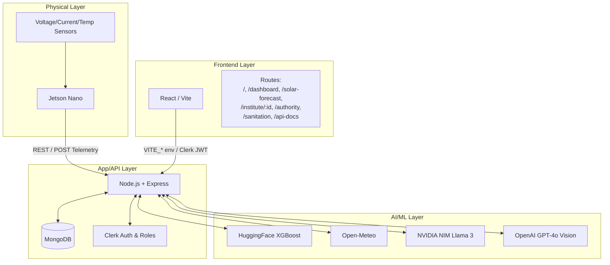
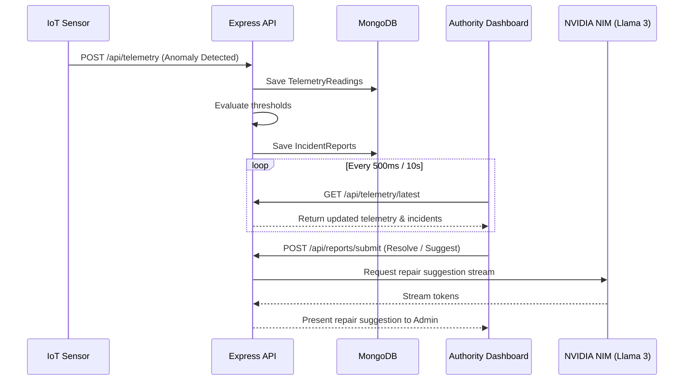

# Architecture Document

## Section 1 — System Diagram

## Section 2 — Database Collections

The MongoDB database is composed of several core collections:
- **Districts**: Master list of regional zones.
- **Institutes**: Facility metadata, including `latitude` and `longitude` fields for GIS mapping, and static specs for the PV installation and batteries.
- **TelemetryReadings**: IoT sensor logs, time-series data with timestamps tracking generated power and infrastructure environment.
- **CentreData**: Extensive audit parameters containing inverter ratings, monthly power consumption, ILR (Ice Lined Refrigerator) count, deep freezer count, and site photos.
- **IncidentReports**: Active and resolved facility failures or anomalies raised either automatically via Telemetry thresholds or manually.
- **AuditLogs**: Historical actions tracked for compliance purposes.

## Section 3 — Sequence Diagram

## Section 4 — State Dashboard Integration

For the Chhattisgarh Unified State Dashboard, Resilo provides the following endpoints to stream compatible compliance and operational data. All endpoints return data in standard `application/json` format.

- **`/api/institutes`**: Returns the standard facility ID (`_id`), human-readable name, facility type, and `latitude` & `longitude` arrays ideal for state-wide GIS plotting.
- **`/api/telemetry/latest`**: Exposes real-time facility infrastructure telemetry. Time values are formatted as strict ISO 8601 timestamps (`timestamp`), making ingestion into state time-series databases trivial.
- **`/api/reports/active`**: Streams active facility faults and alerts matching standard JSON reporting structures, complete with facility correlation IDs.
